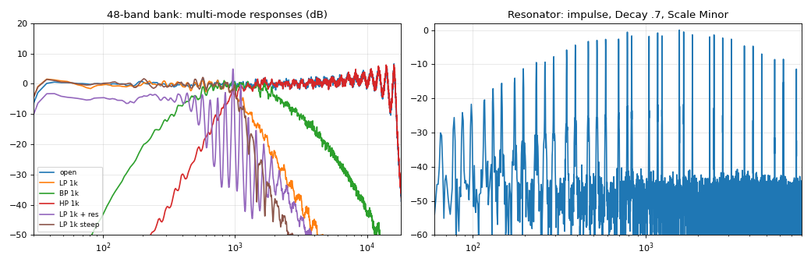

# Sculpt — User Manual

**Four-track sculpting sampler for Ableton Move (Schwung overtake tool)**
Version 0.1.0-alpha

> **Status: alpha, not yet tested on hardware.** The engine and UI pass a full offline test suite and run in the browser simulator, but Sculpt has not been run on a real Move yet. Back up your sets before installing, and know how to restore your Move in DFU mode. It is unofficial and not affiliated with Ableton, Torso Electronics or the Schwung project.

---

## 1. What it is

Sculpt turns the Move into a four-track sculpting sampler, in the spirit of tape-style samplers like the Torso S-4. Each of the four stereo tracks runs the same fixed chain of five devices:

```
Material -> Granular -> Filter -> Color -> Space -> Mixer
   ^ 4 modulators per track         Punch FX -> Master comp -> out
```

- **Material:** a tape loop or an 8-voice sampler. Load WAVs, record the Move's input, or resample Sculpt's own output.
- **Granular:** a grain cloud built from the last 3 seconds of the track.
- **Filter:** a 48-band resonant filter bank. It works as an ordinary LP/BP/HP filter or as a tuned, playable resonator.
- **Color:** two-band drive, bit crush, downsampling, compression and noise.
- **Space:** tape, clean or ping-pong delay into a reverb, with freeze.

Beyond the per-track chain there are 4 modulators per track, 32 morphable scenes and 4 hold-to-play punch-in effects.

Sculpt takes over the whole Move surface while it's open. Press **Back** to return to Move with Sculpt still playing in the background. **Shift+Back** quits it.

---

## 2. Try it without a Move

**https://SANOIII.github.io/schwung-sculpt/** (or `sculpt-sim.html`) is a self-contained web page that runs the **same C engine** (compiled to WebAssembly) and the **same UI script** on a virtual Move. Open it in Chrome or Safari and click the screen to start audio. Demo samples are built in, and you can drop your own WAV, AIFF or MP3 files onto the library panel.

In Chrome, opened as a local file, the page can also use:
- **Mic or audio interface:** in the *Rec input* panel, select **Microphone**, then press **Loop** to hear it through the selected track.
- **MIDI keyboard:** channels 1–4 play tracks 1–4.

Keyboard shortcuts in the simulator:

| Key | Action |
|---|---|
| Q–I / A–K / Z–, | Pads for tracks 1, 2 and 3 |
| 1–8 | Pages |
| Space | Play |
| Enter | Rec |
| Shift | Shift |
| Arrows | Track and sub-page |
| [ ] | Jog |
| \ | Jog click |

---

## 3. Install on a Move

You need a Move with **Schwung** installed and Docker (or an `aarch64-linux-gnu-gcc` toolchain).

```bash
./scripts/build.sh      # cross-compiles and writes dist/sculpt-module.tar.gz
./scripts/install.sh    # copies to ableton@move.local:/data/UserData/schwung/modules/tools/sculpt
```

**Easiest:** download `sculpt-module.tar.gz` from https://github.com/SANOIII/schwung-sculpt/releases/latest. Unpack it and copy the `sculpt` folder into `/data/UserData/schwung/modules/tools/` on the Move (for example with Cyberduck over SFTP), or run:

```bash
scp -r sculpt ableton@move.local:/data/UserData/schwung/modules/tools/
```

Then open the Schwung menu and choose **Tools → Sculpt**. If it isn't listed, rescan modules in Schwung Manager at `http://move.local:7700`.

**Files Sculpt creates on the Move:**
- `/data/UserData/schwung/sculpt/state.txt`: the session (all settings and scenes)
- `UserLibrary/Samples/Sculpt/`: your recordings, as WAV files

---

## 4. The surface


| Control | Action |
|---|---|
| **Track buttons** | Select track |
| Shift + Track | Play / stop that track |
| Mute + Track | Mute / unmute |
| Delete + Track | Clear the track's audio |
| Copy + Track | Copy the selected track's settings to that track |
| **Up / Down** | Previous / next track |
| **Steps 1–8** | Pages: Material, Granular, Filter, Color, Space, Mod, Mix, Scenes |
| **Steps 9–12** | Mute tracks 1–4 (lit = unmuted) |
| **Steps 13–16** (hold) | Punch FX: Stutter, Tape stop, Reverse, Freeze |
| **Left / Right** | Sub-page. The page number appears in the header, e.g. `FILTER 1/2`. On the Mod page, picks modulator 1–4. |
| **Knobs 1–8** | Edit the parameters shown on screen. Touch a knob to see its full name and value. |
| Shift + turn | Fine adjustment |
| Delete + touch knob | Reset that parameter to its default |
| **Jog** | Material page: browse samples, click to load into the selected track. Scenes page: morph time. |
| **Pads** | One row per track (top row = track 1). What they do depends on the track's mode (see Material). Playing a row also selects that track. |
| **Play** | Start / stop all tracks |
| **Rec** (or Sample) | Record / overdub into the selected track |
| **Loop** | Toggle *Live input* on the selected track (the input runs through the track's effects) |
| **Capture** | Save the session |
| **Menu** | On-screen help |
| **Back** | Leave Sculpt running in the background |
| Shift + Back | Quit |

**The screen:**
- The header shows the page name and four track boxes. The selected track's box is inverted, a filled box means playing, and a dotted box means recording.
- The lower half shows the 8 parameters for the knobs.
- A small dot next to a parameter means a modulator is moving it.

**Pad colours:** each track has its own colour. The bright pad follows the playhead (Tape) or the playing voices (Poly), and a red flashing row is recording.

---

## 5. Devices

### 5.1 Material (step 1)

**Page 1**

| Knob | Parameter | Notes |
|---|---|---|
| 1 | Mode | **Tape:** one playhead loops the region; pads cue its 8 slices. **Poly:** 8 voices; pads play slices, or a scale in *Chroma* pad mode. |
| 2 | Start | Region start (% of the sample) |
| 3 | Length | Region length (% of what remains after Start) |
| 4 | Pitch | ±24 semitones (varispeed in Tape mode) |
| 5 | Direction | Fwd / Rev / Pong |
| 6 | Attack | 1 ms – 2 s |
| 7 | Release | 5 ms – 4 s |
| 8 | Level | Material level |

**Page 2**

| Knob | Parameter | Notes |
|---|---|---|
| 1 | Fine | ±100 cents |
| 2 | Pads | Slice / Chroma |
| 3 | Src | What Rec records: **Input** (the Move's line-in or mic) or **Master** (resample Sculpt) |
| 4 | Live | Pass the input through this track, so Sculpt works as a four-lane effects processor |
| 5 | Keep | Overdub feedback: how much of the old audio survives each pass |
| 6 | Quant | First-recording length: Free / Beat / Bar |
| 7 | InGn | Input gain (50% = unity) |

**Recording:**
1. Select a track and press **Rec**.
2. On an empty track, the first pass sets the loop length. It is rounded to whole beats or bars at the Move's tempo, and can be up to 30 s. When you stop, the loop plays straight away.
3. Press **Rec** on a track that already has material to **overdub** at the playhead.

**Loading samples:** on this page, turn the jog to browse the WAVs in `UserLibrary/Samples` (any bit depth, mono or stereo, any sample rate). Click the jog to load one into the selected track.

### 5.2 Granular (step 2)

Grains are drawn from a rolling 3-second buffer of the track's Material.

| Page | Parameters |
|---|---|
| 1 | Mix, Size (10 ms–1 s), Density (1–80 grains/s, or tempo divisions when synced), Pitch (±24 st), Spray (random position, up to 2.5 s back), Contour (percussive ↔ smooth ↔ reversed swell), Spread (stereo), Freeze (stop writing: the cloud holds its material) |
| 2 | Reverse (probability), Pitch Random (±12 st), Feedback, Sync (density locked to 1/4 … 1/256) |

### 5.3 Filter: 48-band resonant filter bank (step 3)



The bank has 48 sixth-order band-pass filters spread from 30 Hz to 16 kHz. It works in two ways:
- **As a traditional multi-mode filter:** Morph sweeps smoothly from **low-pass** through **band-pass** to **high-pass**, and Slope sets the steepness (6–48 dB/oct). Fully open, the bank sums flat to within about 1 dB.
- **As a resonator:** turn up **Resonance** (band Q) and **Decay** (ring time, up to 4 s) for metallic, bell-like and chiming tones. **Pitch** shifts the whole bank ±24 st. **Scale** snaps every band to Chromatic, Major, Minor, Dorian, Pentatonic, Minor-pentatonic or Whole-tone, rooted on C and moved by Pitch.
  - **Notes** tunes the bank to the notes you are holding on that track, from the pads in *Chroma* mode or MIDI. That lets you *play* the resonator polyphonically. The last chord stays latched after you let go.

| Page | Parameters |
|---|---|
| 1 | Cutoff, Morph (LP → BP → HP), Resonance, Decay, Pitch, Scale, Drive, Mix |
| 2 | Waves (a moving gain pattern across the bands), Wave Rate, Wave Size, Noise (excites the bank so it shimmers on silence), Texture (smooth hiss ↔ crackly dust), Spread (stereo), Env (the input level moves the cutoff), Slope |

The Filter page's screen shows the live gain of all 48 bands, with the cutoff dotted and the active scale named.

*Tip:* Morph = BP, Decay about 70%, Scale = Minor, Noise 25%, Texture 80% gives a self-playing chime pad, even with nothing loaded.

### 5.4 Color (step 4)

| Knob | Parameter | Notes |
|---|---|---|
| 1 | Drive | Two-band saturation |
| 2 | Split | Crossover between the bands, 80 Hz – 8 kHz |
| 3 | L/H | Which band gets the drive |
| 4 | Bits | Bit reduction, 16 → 2 bits |
| 5 | Rate | Downsampling |
| 6 | Comp | Compression with makeup gain |
| 7 | Noise | Hiss that follows the signal level |
| 8 | Mix | Dry / wet |

### 5.5 Space (step 5)

| Page | Parameters |
|---|---|
| 1 | Time (10 ms–2 s, or 1/32 … 1 bar when synced), Feedback, Type (**Clean** / **Tape** with wow, flutter and saturation / **Pong**), Delay Mix, Reverb Size, Reverb Decay (0.3–30 s), Damp, Reverb Mix |
| 2 | Sync (on by default), Freeze (holds the delay and reverb tails forever), Tone (low-pass in the delay's feedback) |

### 5.6 Mod (step 6)

Four modulators per track. Use Left/Right to choose modulator 1–4.

| Knob | Parameter | Notes |
|---|---|---|
| 1 | Type | Sine, Tri, Saw, Square, S&H (stepped random), Drift (smooth random), Env (triggered by the track's pads or notes), Follow (tracks the Material's level) |
| 2 | Rate | 0.02–20 Hz, or 8 bars … 1/64 when Sync is on. For Env it sets the decay. |
| 3 | Depth | ±100% of the target's range |
| 4 | Target | Any continuous parameter on the track, shown as e.g. `FLT Cutoff` |
| 5 | Sync | Free / Sync |
| 6 | Shape | Sine: phase. Tri: skew. Saw: direction. Square: pulse width. Env: attack. |
| 7 | Retrig | Restart the cycle on each pad press |
| 8 | Pol | Bipolar / unipolar |

### 5.7 Mix (step 7)

- **Page 1:** knobs 1–4 set track levels; knobs 5–8 set each track's DJ filter (left of centre = low-pass, right = high-pass).
- **Page 2:** knobs 1–4 set track pans. Knob 5 is the master compressor, 6 the scene morph time, 7 master drive, 8 output level.
- When no knob is touched, the screen shows a level meter for each track.

### 5.8 Scenes (step 8)

On this page the 32 pads become scene slots:

| Action | Result |
|---|---|
| Tap a pad | Recall the scene |
| Shift + pad | Store the current state |
| Delete + pad | Clear the slot |

A scene stores every track parameter. Samples and recordings are not stored.

**Morph** (knob 1 or the jog on this page) glides continuous parameters to the new scene over 1 ms – 8 s. Switches such as Mode and Scale change instantly.

---

## 6. Punch-in effects (hold steps 13–16)

These work on the master and release smoothly:

| Step | Effect |
|---|---|
| 13 | **Stutter:** repeats the last 1/8 note |
| 14 | **Tape stop:** slows to a halt over about 1 s |
| 15 | **Reverse:** plays the last ~2 beats backwards, repeating |
| 16 | **Freeze:** holds the grains, delay and reverb on every track |

---

## 7. MIDI

External MIDI **channels 1–4 play tracks 1–4**, with C3 (note 60) as the sample's original pitch.
- **Poly mode:** each track becomes a playable sampler.
- **Tape mode:** notes cue the loop start.
- Notes also trigger *Env* modulators and feed the Filter's *Notes* scale.

Sculpt follows the Move's tempo for synced delays, grains, modulators and recording quantisation.

---

## 8. Known limitations (v0.1 alpha)

- **Not yet run on real hardware.** CPU estimates are extrapolated from a PC:
  - Typical use: about 15–25% of the audio thread's free time.
  - Everything maxed on all four tracks: about 30–50%, with rare peaks higher.
  - The grains and the filter bank are the expensive parts. Turn them off first if you hear dropouts.
- **No start-sync.** Loops free-run at the Move's tempo; they don't start with Move's sequencer.
- **Tracks hold up to 30 s.** Longer files are truncated.
- **Scenes don't recall samples.**
- **Using the Move's own sequencer or synths at the same time as Sculpt is untested.**

---

## 9. Feedback wanted

Please report in the Schwung Discord thread:

1. **Does it load and run** on your Move? Please include your Schwung version.
2. **Audio dropouts:** which settings, and how many tracks were active? Schwung's `docs/DIAGNOSTICS.md` explains how to capture timing data.
3. **Controls:** anything that feels wrong compared with Move conventions or other Schwung tools, and which controls you'd rather see mapped differently.
4. **Sound:** filter bank, grains and punch FX. Is anything too quiet, too loud or harsh?
5. **Features:** what's missing for your workflow (start-sync, per-scene samples, macros...).

---

*Built with AI assistance (Anthropic's Claude), with human direction and review. MIT licence. Thanks to the Schwung and Move Anything projects, which make modules like this possible.*
