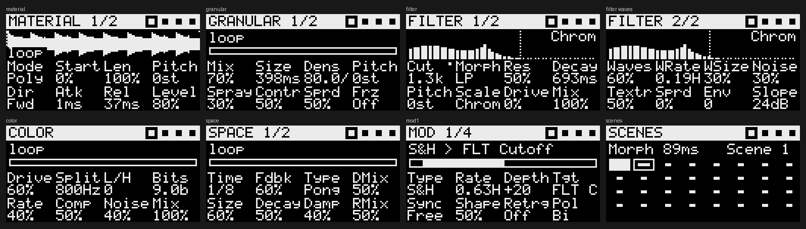

# Sculpt — a four-track sculpting sampler for Ableton Move (Schwung)

Sculpt is a [Schwung](https://schwung.dev) **overtake tool** for Ableton Move. It borrows the workflow of tape-style "sculpting samplers" like the Torso S-4: four parallel stereo tracks, each running the same five-device chain.

```
 Material ─▶ Granular ─▶ Filter ─▶ Color ─▶ Space ─▶ Mixer ─▶ Punch FX ─▶ Master comp
 (tape/poly   (grains     (morph,    (2-band   (delay +
  sampler,     from a      ladder,    drive,    FDN reverb,
  rec/odub)    live buf)   comb,      bits,     freeze)
                           vowel)     comp,
                                      noise)
      ▲ 4 modulators per track (LFO / S&H / drift / envelope / follower)
```



**▶ Try it in your browser: https://SANOIII.github.io/schwung-sculpt/** (no Move needed)
**Manual:** [MANUAL.md](MANUAL.md) · [PDF](docs/Sculpt-Manual.pdf) · **Download for Move:** [latest release](https://github.com/SANOIII/schwung-sculpt/releases/latest)

Unofficial. It is not affiliated with Torso Electronics, Ableton or the Schwung project.

## What's in v0.1

| Device | Parameters |
|---|---|
| **Material** | Mode (Tape / Poly), Start, Length, Pitch, Direction (Fwd/Rev/Pong), Attack, Release, Level · *page 2:* Fine, Pad mode (Slice/Chroma), Rec source (Input/Master), Live input, Overdub keep, Rec quantise (Free/Beat/Bar), Input gain |
| **Granular** | Mix, Size, Density, Pitch, Spray, Contour, Spread, Freeze · *page 2:* Reverse prob., Pitch random, Feedback, Sync |
| **Filter** (48-band resonant bank) | Cutoff, Slope morph (LP → BP → HP), Resonance (band Q), Decay (band ring time), Pitch (±24 st), Scale (Free, Chromatic, Major, Minor, Dorian, Pentatonic, Minor pent., Whole-tone, *Notes* = the notes held on the track), Drive, Mix · *page 2:* Waves, Wave rate, Wave size, Noise, Noise texture (hiss → dust), Stereo spread, Envelope amount, Slope (6–48 dB/oct) |
| **Color** | Drive, Band split, Low/High balance, Bit crush, Downsample, Compress, Noise, Mix |
| **Space** | Delay time, Feedback, Type (Clean / Tape / Ping-pong), Delay mix, Reverb size, Decay, Damp, Reverb mix · *page 2:* Sync, Freeze, Delay tone |
| **Mod ×4** | Type (Sine, Tri, Saw, Square, S&H, Drift, Env, Follower), Rate (free or tempo-synced), Depth, Target (any continuous parameter on the track), Sync, Shape, Retrigger, Polarity |
| **Mix** | Per-track level, pan, DJ filter, mute · Master compressor, scene morph time, master drive, output |
| **Scenes** | 32 slots. Each stores every track parameter and can morph from one scene to the next over 1 ms–8 s |
| **Punch FX** | Hold-to-engage Stutter, Tape stop, Reverse, Freeze |

- **Recording:** Rec records the Move's audio input into the selected track. The first pass sets the loop length, snapped to a beat or bar at Move's tempo. Press Rec again on a track that has material to overdub at the playhead. Set *Src → Master* to resample Sculpt's own output.
- **Samples:** On the Material page, turn the jog wheel to browse WAVs in `UserLibrary/Samples` and click to load. The loader accepts 8, 16, 24 and 32-bit int or float WAVs, mono or stereo, at any sample rate. Each track holds up to 30 s.
- **Sessions:** Capture saves the session. Sculpt also autosaves every 2 minutes and on quit. Settings and scenes go to `/data/UserData/schwung/sculpt/state.txt`. New recordings are written as WAVs to `UserLibrary/Samples/Sculpt/`, and the session reloads them next time.
- **External MIDI:** Notes on channels 1–4 play tracks 1–4 chromatically, with C3 (note 60) as the root. In Poly mode this makes each track a sampler instrument.

### The filter bank

The Filter device is a bank of 48 band-pass filters, spaced about 0.19 octaves apart from 30 Hz to 16 kHz. Each band is 6th-order: three cascaded SVF stages.

- **Traditional filter:** Per-band gain curves turn the bank into a multi-mode filter. Morph moves from Butterworth-style low-pass through Gaussian band-pass to high-pass, and Slope sets the steepness (6–48 dB/oct). With every band open, the bank sums flat to within about 1 dB. A low-pass at 1 kHz is about 48 dB down two octaves above the cutoff.
- **Resonator:** Resonance raises every band's Q. Decay sets each band's ring time (up to 4 s), which gives metallic, bell-like and chiming tones. Pitch shifts the whole bank ±24 semitones, and Scale snaps each band to a scale. *Notes* tunes the bank to whatever you're holding on that track (Chroma pads or MIDI), so it can be played as a polyphonic resonator.
- **Page 2:** Waves sweep a moving gain pattern across the bands. Noise feeds hiss, or sparse "dust" clicks, into the bank so it shimmers even on silence.

`tests/filter_probe.c` and `tests/filter_analyze.py` check all of this against measured responses.

## Controls

| Control | Action |
|---|---|
| Track buttons | Select track · **Shift+** play/stop that track · **Mute+** mute · **Delete+** clear · **Copy+** copy the selected track's settings to it |
| Up / Down | Previous / next track |
| Steps 1–8 | Material, Granular, Filter, Color, Space, Mod, Mix, Scenes |
| Steps 9–12 | Mute tracks 1–4 |
| Steps 13–16 (hold) | Stutter, Tape stop, Reverse, Freeze |
| Left / Right | Sub-page (Mod: modulators 1–4) |
| Knobs 1–8 | Edit parameters · **Shift+turn** for fine steps · **Delete+touch** resets to default |
| Jog | Material page: browse samples, click to load · Scenes page: morph time |
| Pads | One row per track (top row = track 1). Tape mode: cue the 8 slices of the loop region. Poly mode: play 8-voice slices (or a scale in *Chroma* mode). |
| Pads on the Scenes page | Tap: recall · **Shift+pad**: store · **Delete+pad**: clear |
| Play | Start/stop all tracks |
| Rec (or Sample) | Record / overdub into the selected track |
| Loop | Toggle live input through the selected track, to use it as an effects chain |
| Capture | Save session |
| Menu | On-screen help |
| Back | Leave Sculpt running in the background and return to Move · **Shift+Back** quits |

## Try it without a Move

`dist/sculpt-sim.html` is a single self-contained page. It runs the same `sculpt.c` compiled to WebAssembly (`-DSCULPT_WEB`), driven by the unmodified `ui.js`, on a virtual Move with pads, knobs, jog, steps and LEDs. Open it in any browser and click the screen to start audio.

- Demo samples are built in. Drop your own WAV, AIFF or MP3 files on the library panel.
- Rec input can be a test melody, a looping library sample, or (in Chrome, opened as a local file) your mic or audio interface.
- Web MIDI works in Chrome too: channels 1-4 play tracks 1-4.
- To rebuild it: compile the wasm (see `sim/build_sim.py`), then run `python3 sim/build_sim.py`.

## Build and install

You need Docker (or an `aarch64-linux-gnu-gcc` toolchain) and a Move with Schwung installed.

```bash
./scripts/build.sh          # cross-compiles dsp.so and writes dist/sculpt-module.tar.gz
./scripts/install.sh        # copies to ableton@move.local:/data/UserData/schwung/modules/tools/sculpt
```

On the Move, open the Schwung menu and go to **Tools → Sculpt**. If Sculpt doesn't show up, rescan modules in Schwung Manager at `http://move.local:7700`.

To put it on your own GitHub in one step, run `./scripts/publish_to_github.sh` (needs the GitHub CLI: `brew install gh`). It creates the repo, pushes, and tags the release. Or do it by hand: push a `v0.1.0-alpha` tag. `.github/workflows/release.yml` runs the host tests, cross-compiles, attaches `sculpt-module.tar.gz` to a GitHub release and updates `release.json`. After that, open a PR adding Sculpt to Schwung's `module-catalog.json`, with `component_type: "tool"` and `asset_name: "sculpt-module.tar.gz"`.

## Tests (no Move needed)

```bash
./scripts/test.sh
```

- `tests/render_test.c` loads the plugin the same way the shim does and feeds it a fake mailbox with a synthetic line input. It checks sample loading and resampling, all filter and delay types, poly pads, Move pad notes, bar-quantised recording, overdub, scenes, punch FX, save and reload, and render time per block.
- `tests/ui_harness.mjs` runs `ui.js` headless against the real parameter table. It renders every page to `build/screens/*.pbm` and checks that controls send the right DSP commands and that LED output is rate-limited.

## Architecture notes

- **Realtime safety:** Every plugin entry point runs on Move's SPI audio thread. `sculpt.c` never allocates, touches files or logs in `render_block`, `set_param`, `get_param` or `on_midi`. A `SCHED_OTHER` worker pinned to cores 0–2 does all of that: allocating the 30 s track buffers, loading and resampling WAVs, scanning the sample folder, and writing state and recordings. The worker hands buffers to the audio thread through atomic pointer swaps, and retired buffers go back to the worker to be freed.
- **UI to DSP:** Overtake `set_param` is fire-and-forget and can drop a write while the channel is busy. The UI therefore queues commands, de-duplicates them per parameter, and sends them as one newline-separated `cmd` batch per tick, retrying if the send is refused. The UI reads back `ui` (transport, recording, playheads, meters) every tick and `values` every 2 s or after a scene recall.
- **Pads** reach the DSP directly through the shim's audio-thread `on_midi` hook, so triggering doesn't wait on the JS round-trip.
- **CPU:** On an x86 host, a worst-case stress test (4 loaded tracks, every device on, 20-grain clouds) takes about 250 µs per 128-frame block, against a budget of about 2.9 ms. A Cortex-A72 will be several times slower, so **check on the device** with Schwung's diagnostics and lower `MAXGRAIN` in `sculpt.c` if needed. When a track is idle and has no tails or freeze, it skips its effects chain.

## Roadmap ideas

- A 48-band resonant filter-bank mode, which needs a SIMD pass to fit the CPU budget
- Per-scene sample assignments, and program change to recall scenes
- Macros: one knob driving several parameters
- Web UI (`web_ui.html`) for the Schwung Manager Tool tab
- Clock-synced start for first-pass recording
